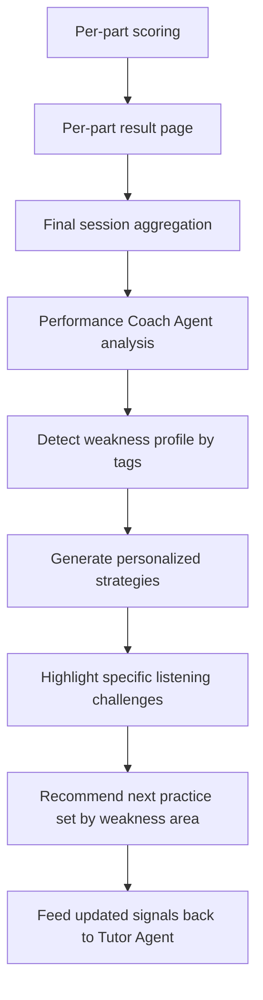

# Listening Module Process Flow

This document defines the end-to-end process flow for the listening module, from onboarding to personalized post-test recommendations.

## Scope

- 4 sections (Part 1-4)
- 10 questions per section (40 total)
- 32 minutes total (8 minutes average per section)
- Each section uses 2-3 question type engines across its 10 questions
- Each section script is generated as 3 linked segments (to respect 2-3 minute script-generation constraints)
- Section generation runs sequentially on the backend
- Per-section result page + final personalized result page

## End-to-End User Journey (Process Flow)

```mermaid
flowchart LR
    subgraph U[User]
      U1([Start])
      U2[Complete Onboarding]
      U3[Open Weekly Listening Session]
      U4[Attempt Part 1]
      U5[View Part 1 Result]
      U6[Attempt Part 2]
      U7[View Part 2 Result]
      U8[Attempt Part 3]
      U9[View Part 3 Result]
      U10[Attempt Part 4]
      U11[View Part 4 Result]
      U12[View Final Personalized Report]
    end

    subgraph APP[Application]
      A1[Persist Onboarding Profile]
      A2[Create Weekly Listening Plan]
      A3[Create Session Orchestration Job]
      A4{Is Part 1 Published?}
      A5[Launch Listening UI]
      A6[Capture Answers, Timing, Playback Events]
      A7[Compute and Store Part Result]
      A8[Aggregate Full Session Results]
      A9[Render Final Report]
    end

    subgraph AG[Agents]
      G1[Tutor Agent: Weekly Plan]
      G2[Script Agent: Blueprint + 3 Linked Scripts + Accent Plan]
      G3[Question Agent: Question Blocks via JSON Config]
      G4[Performance Coach Agent: Weakness Analysis + Recommendations]
    end

    subgraph ORCH[Backend Orchestrator]
      O1[Sequential Sections: S1 to S4]
      O2[Generate Story Blueprint for Section]
      O3[Generate 3 Linked Script Segments]
      O4[Generate Question Blocks for Segments]
      O5[TTS Render with Accent Variant(s)]
      O6[Validate Schema, Anchors, Keys]
      O7[Publish Section Assets]
      O8{More Sections Pending?}
    end

    U1 --> U2 --> A1 --> G1 --> A2 --> A3 --> O1
    O1 --> G2 --> O2 --> O3 --> G3 --> O4 --> O5 --> O6 --> O7 --> O8
    O8 -- Yes --> O1
    O8 -- No --> A4
    A4 -- No --> O1
    A4 -- Yes --> A5 --> U3

    U3 --> U4 --> A6 --> A7 --> U5
    U5 --> U6 --> A6 --> A7 --> U7
    U7 --> U8 --> A6 --> A7 --> U9
    U9 --> U10 --> A6 --> A7 --> U11

    U11 --> A8 --> G4 --> A9 --> U12
```

## Section Generation Pipeline (Sequential Backend)

```mermaid
flowchart TD
    S0([Section N starts]) --> S1[Load section plan from weekly tutor plan]
    S1 --> S2[Script Agent creates section story blueprint]
    S2 --> S3[Script Agent creates segment A (2-3 min)]
    S3 --> S4[Script Agent creates segment B (2-3 min)]
    S4 --> S5[Script Agent creates segment C (2-3 min)]
    S5 --> S6[Question Agent creates 3 question blocks JSON]
    S6 --> S7[Map 10 questions across 2-3 question types]
    S7 --> S8[TTS render for segment A/B/C with accent profile]
    S8 --> S9[Validation: schema, timings, anchors, answer keys]
    S9 --> S10{Validation pass?}
    S10 -- No --> S11[Retry failed step with idempotency key]
    S11 --> S9
    S10 -- Yes --> S12[Publish section package]
    S12 --> S13[Mark section ready]
    S13 --> S14([Trigger next section N+1])
```

## Result and Recommendation Flow



## Operational Notes

- Backend section generation must run in order (`Part 1 -> Part 2 -> Part 3 -> Part 4`) to control load and provider cost.
- User-perceived latency is reduced by ensuring `Part 1` is ready before launch while `Part 2-4` continue in background.
- Question rendering must be fully config-driven (JSON) to support varied question engines without hardcoded UI branches.
- Store detailed attempt metadata for diagnostics: response edits, dwell time, replay behavior, unanswered items, and question-type errors.
