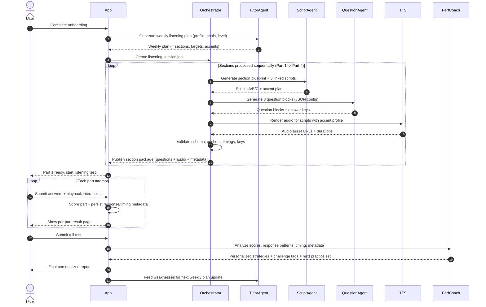

# Listening Module Sequence Diagram

This document captures the interaction sequence across `User`, `App`, `Orchestrator`, `Agents`, and `TTS` for the listening workflow.

## Sequence Diagram

## Flow Summary

1. User onboarding data is converted into a weekly listening plan by the Tutor Agent.
2. App starts a session orchestration job.
3. Orchestrator processes sections in strict sequence (`Part 1 -> Part 2 -> Part 3 -> Part 4`).
4. For each section, Script Agent and Question Agent generate content, then TTS renders audio.
5. Orchestrator validates and publishes each section package.
6. User completes each part and receives per-part result pages.
7. At final submission, Performance Coach generates personalized strategies, challenge diagnosis, and recommended next practice set.
8. Weakness signals are fed back to Tutor Agent for next-week adaptation.
